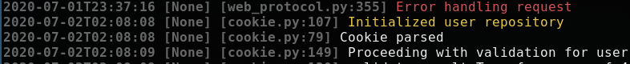

# klogdriver
Parse kubernetes `kubectl logs` stackdriver json format for better local visualization.

It will transform this:
```
2020-07-03T03:38:49.643724305Z {"message": "Initialized user repository", "module": "cookie.py:107", "severity": "DEBUG"}
2020-07-03T03:38:49.64442566Z {"message": "Cookie parsed", "module": "cookie.py:79", "severity": "INFO"}
2020-07-03T03:38:49.794202603Z {"message": "Proceeding with validation for user", "module": "cookie.py:149", "severity": "INFO"}
```

Into this:


## Installing
### 1 - Download the latest release
```
sudo mv klogdriver /usr/local/bin
```

### 2 - Create and alias in your .bashrc or .zshrc
```
function klog () { kubectl logs -f --timestamps $@ | klogdriver ; }
```
